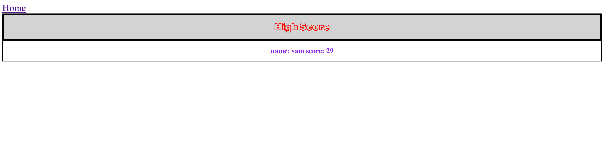
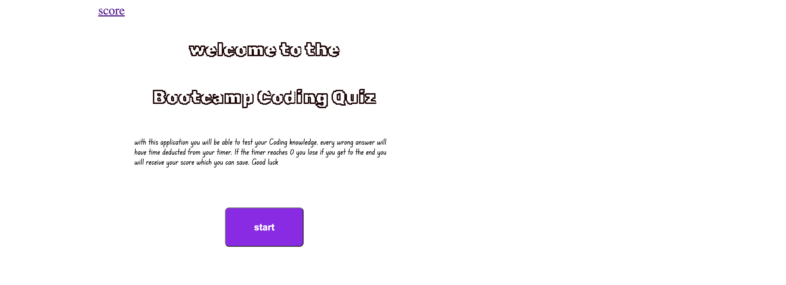

# Code-quiz

## Description
The reason for this website is to test the users knowledge of programing by quizzing them on various topics it also allows the user to save their score (based on the time) to their local storage so they can see their score on the score webpage and track their improvement.

## Installation
N/A

## Usage
To use this application the user starts at the main page with a title and a start button. once the start button is clicked the timer will start and the questions will pop up. every time the user clicks an answer the application will change to the next question. if the user clicks the wrong answer time will be deducted from their timer. if the timer reaches 0 the user will lose and be asked to try again if they get through all the questions their time will be turned to a score from 1-100 and will be asked for their initials and a submit button to submit their results to local storage. they can also got to the score webpage to view their most recently save score and the can click the restart button to try again.
Here are photos of the application 

here is a link to the website application.  https://sam-dejesus.github.io/Code-quiz/
## Credits
N/A

## License
refer to the repo